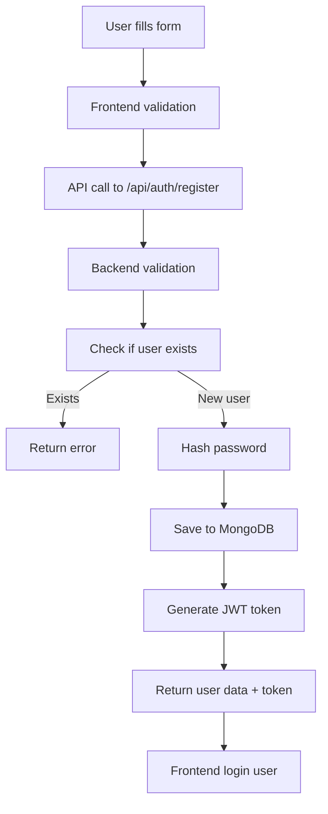
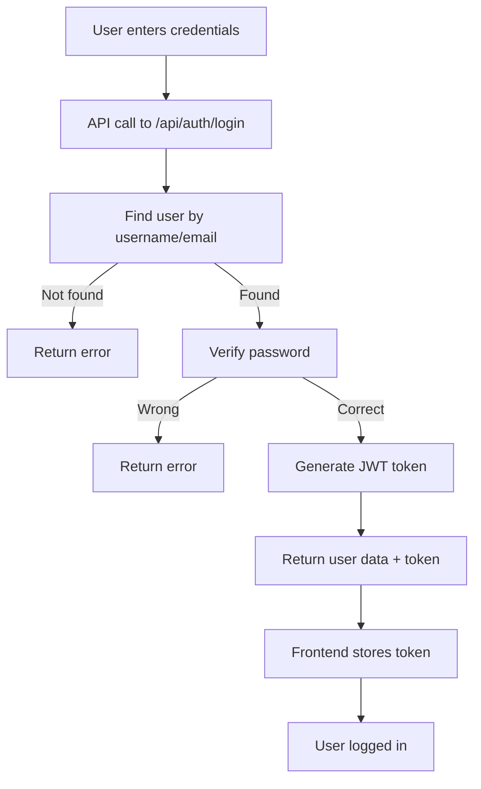

# BloxMarket Authentication System 🔐

## Overview

BloxMarket uses a secure JWT-based authentication system with MongoDB for user data storage. This guide covers user registration, login, and authentication management.

## 🚀 Quick Start

### Prerequisites
- MongoDB running on `localhost:27017`
- Backend server running on `http://localhost:5000`
- Frontend running on `http://localhost:5173`

### Test the Authentication
1. Start your servers:
   ```bash
   # Terminal 1 - Backend
   cd backend && npm run dev
   
   # Terminal 2 - Frontend
   cd frontend && npm run dev
   ```

2. Visit `http://localhost:5173`
3. Try registering a new account or logging in

## 📝 User Registration

### Registration Form Fields

| Field | Type | Required | Description |
|-------|------|----------|-------------|
| **Username** | String | ✅ Yes | Unique identifier (3-50 chars) |
| **Email** | String | ✅ Yes | Valid email address |
| **Password** | String | ✅ Yes | Minimum 6 characters |
| **Roblox Username** | String | ❌ Optional | Link to Roblox account |
| **Avatar URL** | String | ❌ Optional | Profile picture URL |

### Registration Process



### API Endpoint: Registration

**POST** `/api/auth/register`

**Request Body:**
```json
{
  "username": "johndoe",
  "email": "john@example.com",
  "password": "securepassword123",
  "robloxUsername": "JohnRoblox" // optional
}
```

**Success Response (201):**
```json
{
  "message": "User registered successfully",
  "token": "eyJhbGciOiJIUzI1NiIsInR5cCI6IkpXVCJ9...",
  "user": {
    "id": "507f1f77bcf86cd799439011",
    "username": "johndoe",
    "email": "john@example.com",
    "robloxUsername": "JohnRoblox",
    "role": "user"
  }
}
```

**Error Responses:**
```json
// 400 - Missing fields
{
  "error": "Username, email, and password are required"
}

// 400 - User exists
{
  "error": "Username or email already exists"
}

// 500 - Server error
{
  "error": "Failed to register user"
}
```

## 🔑 User Login

### Login Form Fields

| Field | Type | Required | Description |
|-------|------|----------|-------------|
| **Username/Email** | String | ✅ Yes | Username or email address |
| **Password** | String | ✅ Yes | User's password |

### Login Process



### API Endpoint: Login

**POST** `/api/auth/login`

**Request Body:**
```json
{
  "username": "johndoe", // or email: "john@example.com"
  "password": "securepassword123"
}
```

**Success Response (200):**
```json
{
  "message": "Login successful",
  "token": "eyJhbGciOiJIUzI1NiIsInR5cCI6IkpXVCJ9...",
  "user": {
    "id": "507f1f77bcf86cd799439011",
    "username": "johndoe",
    "email": "john@example.com",
    "robloxUsername": "JohnRoblox",
    "role": "user",
    "credibilityScore": 0
  }
}
```

**Error Responses:**
```json
// 400 - Missing fields
{
  "error": "Username and password are required"
}

// 401 - Invalid credentials
{
  "error": "Invalid credentials"
}

// 500 - Server error
{
  "error": "Failed to login"
}
```

## 🔒 JWT Token Management

### How JWT Tokens Work

1. **Generation**: Server creates JWT with user ID and username
2. **Storage**: Frontend stores token in `localStorage`
3. **Usage**: Token sent in `Authorization` header for protected routes
4. **Verification**: Server validates token for each protected request

### Token Structure
```javascript
// Token payload
{
  "userId": "507f1f77bcf86cd799439011",
  "username": "johndoe",
  "iat": 1640995200,  // issued at
  "exp": 1641081600   // expires (24h later)
}
```

### Protected Routes
All API routes requiring authentication use the `authenticateToken` middleware:

```javascript
// Example protected route
app.get('/api/auth/me', authenticateToken, (req, res) => {
  // req.user contains decoded token data
});
```

## 🔐 Security Features

### Password Security
- **Hashing**: bcryptjs with 12 salt rounds
- **No plain text**: Passwords never stored in plain text
- **Validation**: Minimum 6 characters required

### JWT Security
- **Secret key**: Configurable via `JWT_SECRET` environment variable
- **Expiration**: 24-hour token expiry (configurable)
- **HTTP-only**: Consider using HTTP-only cookies for production

### Input Validation
- **Username**: Alphanumeric, 3-50 characters
- **Email**: Valid email format required
- **Sanitization**: All inputs sanitized before database storage

### Rate Limiting
- **15-minute window**: 100 requests per IP
- **DDoS protection**: Prevents brute force attacks
- **Configurable**: Adjust limits in server.js

## 🛠️ Frontend Integration

### Authentication Context

```typescript
// App.tsx - Authentication context
const AuthContext = createContext<{
  user: any;
  login: (userData: any) => void;
  logout: () => void;
  isLoggedIn: boolean;
  isLoading: boolean;
}>()
```

### Auto-login on Page Load

```typescript
// Check for existing token on app startup
useEffect(() => {
  const token = localStorage.getItem('bloxmarket-token');
  if (token) {
    apiService.getCurrentUser()
      .then((userData) => {
        setUser(userData);
        setIsLoggedIn(true);
      })
      .catch(() => {
        // Clear invalid token
        localStorage.removeItem('bloxmarket-token');
      });
  }
}, []);
```

### API Service Usage

```typescript
// Login example
const handleLogin = async (credentials) => {
  try {
    const response = await apiService.login(credentials);
    login(response.user); // Update auth context
  } catch (error) {
    setError(error.message);
  }
};

// Logout example  
const handleLogout = () => {
  logout(); // Clears token and user state
};
```

## 🧪 Testing Authentication

### Manual Testing

1. **Registration Test:**
   ```bash
   curl -X POST http://localhost:5000/api/auth/register \
     -H "Content-Type: application/json" \
     -d '{
       "username": "testuser",
       "email": "test@example.com",
       "password": "password123"
     }'
   ```

2. **Login Test:**
   ```bash
   curl -X POST http://localhost:5000/api/auth/login \
     -H "Content-Type: application/json" \
     -d '{
       "username": "testuser",
       "password": "password123"
     }'
   ```

3. **Protected Route Test:**
   ```bash
   curl -X GET http://localhost:5000/api/auth/me \
     -H "Authorization: Bearer YOUR_JWT_TOKEN_HERE"
   ```

### Browser Testing

1. **Open Developer Tools** (F12)
2. **Register/Login** through the UI
3. **Check Application Tab** → Local Storage → `bloxmarket-token`
4. **Verify Network Requests** in Network tab

## 🚨 Troubleshooting

### Common Issues

| Problem | Cause | Solution |
|---------|-------|----------|
| "MongoDB connection failed" | MongoDB not running | `net start MongoDB` |
| "Invalid credentials" | Wrong username/password | Check spelling, case sensitivity |
| "User already exists" | Duplicate username/email | Try different credentials |
| "Token expired" | JWT token too old | Login again |
| "CORS error" | Frontend/backend port mismatch | Check FRONTEND_URL in .env |

### Debug Steps

1. **Check MongoDB Status:**
   ```bash
   sc query MongoDB
   ```

2. **Verify Backend Health:**
   ```bash
   curl http://localhost:5000/api/health
   ```

3. **Check Database Contents:**
   ```bash
   mongosh mongodb://localhost:27017/Bloxmarket
   db.users.find().pretty()
   ```

4. **View Server Logs:**
   Look at backend terminal for error messages

## 📂 File Structure

```
backend/
├── models/
│   └── User.js           # User schema definition
├── routes/
│   └── auth.js           # Authentication endpoints
├── server.js             # Express server setup
└── .env                  # Environment variables

frontend/
├── src/
│   ├── components/
│   │   └── AuthPage.tsx  # Login/Register UI
│   ├── services/
│   │   └── api.ts        # API service layer
│   └── App.tsx           # Authentication context
```

## 🔧 Configuration

### Environment Variables (.env)

```env
# JWT Configuration
JWT_SECRET=your-super-secret-jwt-key-change-this-in-production
JWT_EXPIRES_IN=24h

# MongoDB Configuration  
MONGODB_URI=mongodb://localhost:27017/Bloxmarket

# Server Configuration
PORT=5000
FRONTEND_URL=http://localhost:5173
```

## 🚀 Production Considerations

### Security Enhancements
- [ ] Use HTTPS in production
- [ ] Implement refresh tokens
- [ ] Add email verification
- [ ] Use HTTP-only cookies instead of localStorage
- [ ] Add password complexity requirements
- [ ] Implement account lockout after failed attempts

### Performance Optimizations
- [ ] Add Redis for session storage
- [ ] Implement token blacklisting
- [ ] Add database indexes
- [ ] Use connection pooling

### Monitoring
- [ ] Add authentication metrics
- [ ] Log failed login attempts  
- [ ] Monitor token usage patterns
- [ ] Set up alerts for suspicious activity

---

## 📞 Support

If you encounter issues with authentication:

1. Check the [troubleshooting section](#-troubleshooting) above
2. Verify your MongoDB and backend are running
3. Check browser developer tools for errors
4. Review server logs for detailed error messages

**Happy trading!** 🎮✨